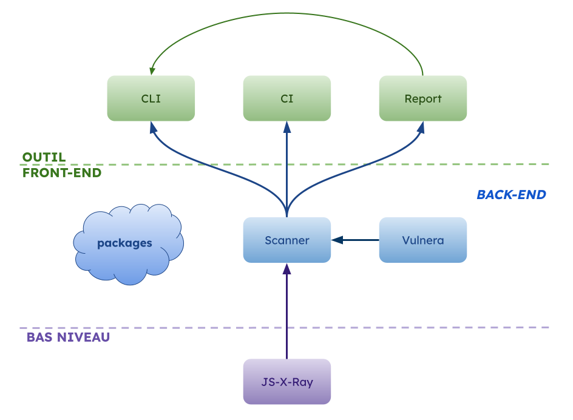

# 🗺️ Cartographie

Lorsque vous commencez à contribuer au projet NodeSecure, il peut être difficile de s'y retrouver : l’organisation s’étend sur plusieurs dépôts GitHub, et regroupe plus d’une vingtaine de packages NPM.

Tous les projets n'ont pas le même niveau de complexité, ni la même fréquence d'activité. Contrairement à une entreprise financée, nous nous appuyons sur l’engagement des contributeurs et mainteneurs pour faire avancer les différents sujets.

Ce guide a pour objectif de vous aider à comprendre la structure de l’écosystème NodeSecure, identifier les projets selon leur rôle et maturité, et faciliter vos premières contributions.

## 🧱 Types de projets

Au sein de NodeSecure, on distingue principalement deux grandes catégories de projets :

- **Les outils**:  comme [CLI](https://github.com/NodeSecure/cli), [CI](https://github.com/NodeSecure/ci) ou [Report](https://github.com/NodeSecure/report), qui permettent d’interagir avec les résultats ou les données de sécurité de manière visuelle ou en ligne de commande.
- **Les packages**: des briques techniques plus proches du "back-end", qui assurent la collecte, l’analyse et le traitement des données.

> [!NOTE]
> Nos packages permettent à n'importe qui de créer leur propre outil visuel, CLI ou CI.

On retrouve également d'autres dépôts liés à la gouvernance, à la gestion du projet ou à sa présentation (par exemple la landing page, les RFCs ou la gouvernance).

## 🛠️ Nature des contributions

Les **outils** sont plus adaptés aux personnes qui souhaitent travailler sur des problématiques proches du front-end, de la CLI ou de l’expérience utilisateur.

Les **packages**, quant à eux, nécessitent une compréhension plus poussée des API.

> [!NOTE]
> Il est souvent plus facile de constater l’impact d’une contribution sur un outil, car les changements sont visibles immédiatement (affichage CLI ou UI).

---

Un projet comme [JS-X-Ray](https://github.com/NodeSecure/js-x-ray) se situe à la frontière entre l’analyse statique, la recherche et les systèmes de compilation (AST, parsing, etc.).
Si ce sujet vous intéresse, nous vous recommandons [cette vidéo réalisée avec Antoine](https://www.youtube.com/watch?v=8l2ByutdFJ8).

## 🧠 Dépôts névralgiques

NodeSecure repose principalement sur trois mono-repos :

- [CLI](https://github.com/NodeSecure/cli) — Outil principal utilisé pour lancer des analyses de sécurité sur des packages NPM avec CLI + interface.
- [Scanner](https://github.com/NodeSecure/scanner) — Contient les API d’analyse back-end.
- [JS-X-Ray](https://github.com/NodeSecure/js-x-ray) — Composant d’analyse statique (SAST) des fichiers JavaScript.

Ceux-ci cumuleront donc majoritairement l'attention et l'énergie des contributeurs pour être maintenu.



### 🌳 Vue arborescente des mono-repos

```
├── cli (mono-repo)
│   ├── @nodesecure/cli
│   ├── @nodesecure/vis-network
│   ├── @nodesecure/size-satisfies
│   └── @nodesecure/documentation-ui
│
├── scanner (mono-repo)
│   ├── @nodesecure/scanner
│   ├── @nodesecure/conformance
│   ├── @nodesecure/contact
│   ├── @nodesecure/i18n
│   ├── @nodesecure/mama
│   ├── @nodesecure/npm-types
│   ├── @nodesecure/rc
│   ├── @nodesecure/tarball
│   ├── @nodesecure/github
│   ├── @nodesecure/gitlab
│   ├── @nodesecure/fs-walk
│   ├── @nodesecure/flags
│   └── @nodesecure/tree-walker
│
├── js-x-ray (mono-repo)
│   ├── @nodesecure/js-x-ray
│   ├── @nodesecure/estree-ast-utils
│   ├── @nodesecure/tracer
│   ├── @nodesecure/sec-literal
│   └── @nodesecure/ts-source-parser
```

### 🏅 Champions recherchés

Un champion est un contributeur qui s’implique activement dans un projet spécifique, en pilotant ses évolutions et en soutenant les autres contributeurs.

Nous recherchons particulièrement des champions pour relancer ou améliorer les projets suivants :

- [Report](https://github.com/NodeSecure/report) — Le rendu du rapport n'a pas évolué depuis plusieurs années.
- [CI](https://github.com/NodeSecure/ci) — Reporting en CI (le projet est actuellement inactif).
- [Vulnera](https://github.com/NodeSecure/vulnera) — Faire avancer les APIs et l'intégration d'OSV.
